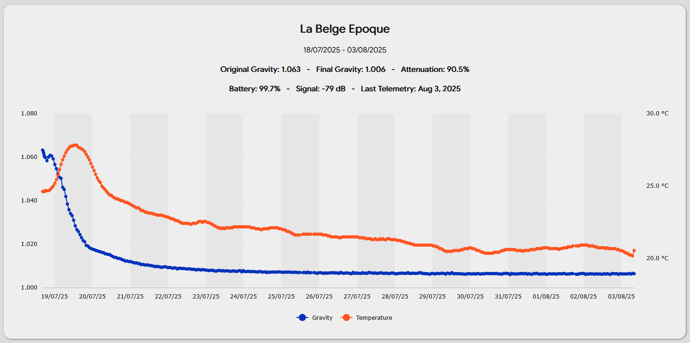

# RaptDash

A better dashboard for the [Rapt Pill](https://kegland.eu/products/yellow-rapt-pill-hydrometer-thermometer-wifi-bluetooth).

For the first version I tried to use the RAPT Rest API, but soon gave up and made my own backend. 

## Features

### v2 - Data via RAPT Webhook

Data can be sent from the RAPT Cloud portal via Webhooks to my backend. The dashboard then displays the active fermentation
session, as well as past sessions. New sessions can be added and old ones deleted.



#### RAPT Webhook

Data from the RAPT Cloud has to be sent to https://bier-freunde.ch/rest/rapt/telemetry.php. The payload should look like this:

```
{
  "mail": $your-email,
  "api_key": $your-api-key,
  "temperature": "@temperature",
  "gravity": "@gravity",
  "battery": "@battery",
  "rssi": "@rssi"
}
```
### v1 - RAPT API

The performance of the RAPT API is not really what it should be and the CORS header are not correctly set
(especially for OPTIONS requests). For use with Firefox a plugin like 'CORS Everywhere' is needed to function properly.

Here is the Swagger UI for the Rest API: [api.rapt.io](https://api.rapt.io/index.html)

Unfortunately, some of the endpoints which are not listed and would be needed for a fully functional app
are not callable (*403 Forbidden*), even with the paid subscription...
