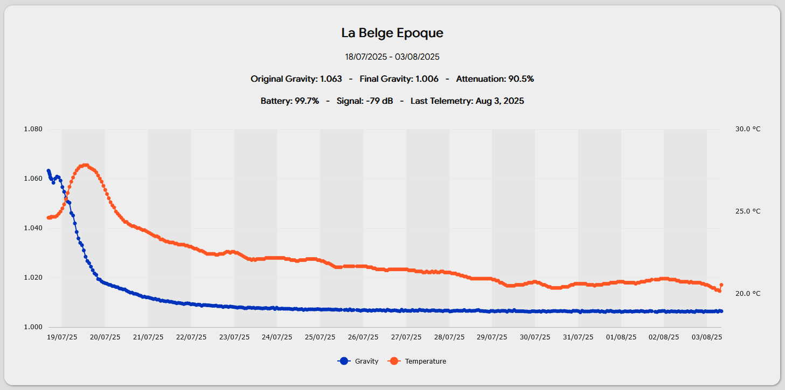

# RaptDash

A better dashboard for the [Rapt Pill](https://kegland.eu/products/yellow-rapt-pill-hydrometer-thermometer-wifi-bluetooth).

For the first version I tried to use the RAPT Rest API, but soon gave up and made my own backend. 

## Features

### v2 - Data via RAPT Webhook or Home Assistant

Data can be sent from the RAPT Cloud portal via Webhooks to my backend or using a Home Assistant integration
(I use it with a raspberry Pi to get the Bluetooth data of the pill).
The dashboard then displays the active fermentation session, as well as past sessions.
New sessions can be added and old ones deleted.



#### API call

Data has to be sent to https://bier-freunde.ch/rest/rapt/telemetry.php. The payload for the POST call
(webhook or restful command) should look like this:

```
{
  "mail": $your-email,
  "api_key": $your-api-key,
  "temperature": "@temperature",
  "gravity": "@gravity",
  "battery": "@battery",
  "rssi": "@rssi"
}
```

If you want to use my backend, just email me, and I'll generate a api_key for you.

##### Using Home Assistant

After using the RAPT webhook for a while, I decided to opt for the Home Assistant integration, as the RAPT webhook
relies on the RAPT cloud being operational, and I observed it being down or unreachable a few times. The Home Assistant
integration is completely independent of the RAPT portal, so I don't rely on Kegland having their servers operational.

Change the Telemetry method of your RAPT pill to bluetooth. Your Home Assistant should then pick up the bluetooth
signal of the pill and ask if you want to add the RAPT integration. After adding the integration,
add the following Restful command to your configuration.yaml

```
rest_command:
  send_rapt_telemetry:
    url: "https://bier-freunde.ch/rest/rapt/telemetry.php"
    method: POST
    headers:
      Content-Type: "application/json"
    payload: >
      {
        "mail": $your-email,
        "api_key": $your-api-key,
        "temperature": "{{ states('sensor.rapt_pill_temperature') | float }}",
        "gravity": "{{ states('sensor.rapt_pill_specific_gravity') | float }}",
        "battery": "{{ states('sensor.rapt_pill_battery') | float }}",
        "rssi": "{{ states('sensor.rapt_pill_signal_strength') | float }}"
      }
```

### v1 - RAPT API

The performance of the RAPT API is not really what it should be and the CORS header are not correctly set
(especially for OPTIONS requests). For use with Firefox a plugin like 'CORS Everywhere' is needed to function properly.

Here is the Swagger UI for the Rest API: [api.rapt.io](https://api.rapt.io/index.html)

Unfortunately, some of the endpoints which are not listed and would be needed for a fully functional app
are not callable (*403 Forbidden*), even with the paid subscription...
